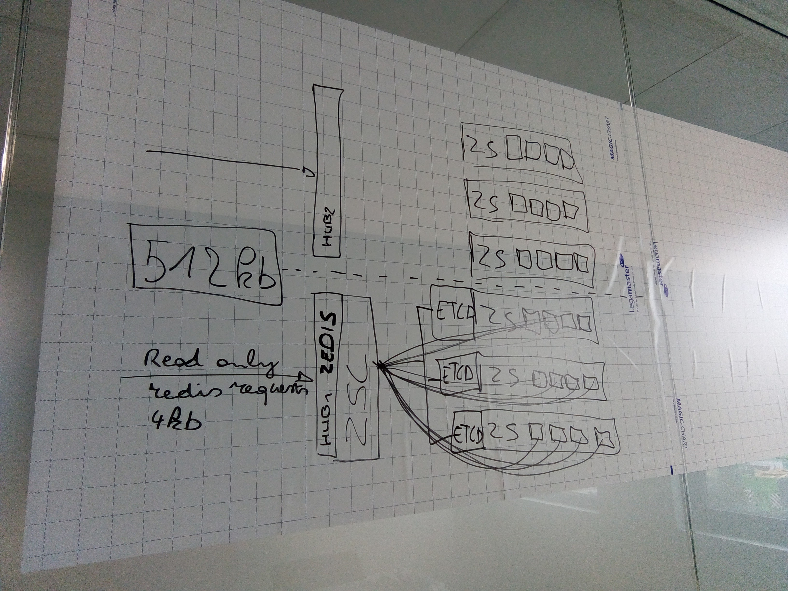

# Zedis

Zedis is a [Redis protocol][redisProtocol] interface for the [0-stor][zeroStor]



## Supported Redis commands

* `PING`: Pings Zedis
    * reply: Pong
* `QUIT`: Closes the connection
* `AUTH`: authenticates the connection
    * expects: JWT
    * reply OK
* `SET`: Set a value
    * expects: key, value
    * reply: OK
* `GET`: Get a value from a key
    * expects: key
    * reply: key value

## Security

### TLS

Zedis can expose 2 TCP ports, one with plaintext traffic and the other with a [TLS][tls] enabled connection.
Certificates can be managed by let's encrypt or by self updating in memory self signed certificates depending on [configuration](#configuration).

The plain TCP port is optional and can be disabled by omitting it from the config file.

### Protected commands

Depending on the configuration, some Redis commands require authentication, these will be authenticated with a [JWT][jwt] from [itsyou.online][iyo].
A JWT for the connection can be set with the AUTH [command](#supported-redis-commands).

The user needs to be member of the the zedis namespace (admin) or write sub organization of the zedis namespace to have permission to `SET` to Zedis and provide that scope in the JWT.
If `GET` requires authentication, the user needs to be admin of the namespace or member of the read sub organization.

e.g. :
```js
// data part of the JWT
{
    ...
    "scope": "user:memberof:zedis_org.zedis_namespace" // admin scope
    ...
}
```

To set which commands require authentication, define them as a comma separated list in the `auth_commands` field in the config file.  
By default, the `SET` command requires authentication.  
If `auth_commands` is set to `none`, none of the commands require authentication.  
If set to `all`, all commands other then `AUTH`, `PING` and `QUIT` require authentication.

## Configuration file

Configuration of Zedis is done through a YAML config file, by default it will be ./config.yaml

```yaml
#zedis specific configuration

port: :6380         #plain tcp port
tls_port: :6381     #tls enabled tcp port
auth_commands: all   # defines the commands that require auth command
jwt_organization: zedis_org      #itsyou.online organization the authenticated used needs to be member of
jwt_namespace: zedis_namespace   #itsyou.online namespace the authenticated used needs to be member of
acme: true          #tls will get it's certificated from let's encrypt
acme_whitelist:     #hostnames let's encrypt is allowed to sign, if empty it will allow all incoming hostnames
    - zedis.org     #only exact matches are currently supported. Subdomains, regexp or wildcard will not match. 
                    # https://godoc.org/golang.org/x/crypto/acme/autocert#HostWhitelist

# configuration for the 0-stor client

organization: zedis_0stor_org       #itsyou.online organization the 0-stor for Zedis belongs to
namespace: zedis_0stor_namespace    #itsyou.online namespace the 0-stor for Zedis belongs to
iyo_app_id: <replace with an itsyou.online app id>  #itsyou.online app id of the Zedis app
iyo_app_secret: <replace with an itsyou.online app secret>  #itsyou.online app secret of the Zedis app
# the address(es) of 0-stor cluster
data_shards:
    - 127.0.0.1:12345
    - 127.0.0.1:12346
    - 127.0.0.1:12347
    - 127.0.0.1:12348
# the address(es) of etcd server(s) for the metadata
meta_shards:
    - http://127.0.0.1:2379
    - http://127.0.0.1:22379
    - http://127.0.0.1:32379

block_size: 4096

replication_nr: 4
replication_max_size: 4096

distribution_data: 3
distribution_parity: 1

compress: true
encrypt: true
encrypt_key: ab345678901234567890123456789012
```

More information about the 0-stor configuration can be found in the [0-stor client config documentation][0storclient]


[zeroStor]:https://github.com/zero-os/0-stor
[redisProtocol]: https://redis.io/topics/protocol
[jwt]: https://jwt.io/
[tls]: https://en.wikipedia.org/wiki/Transport_Layer_Security
[iyo]: https://github.com/itsyouonline/identityserver/blob/master/docs/oauth2/jwt.md#jwt-json-web-token-support
[0storclient]: https://github.com/zero-os/0-stor/tree/master/client#using-0-stor-client-examples